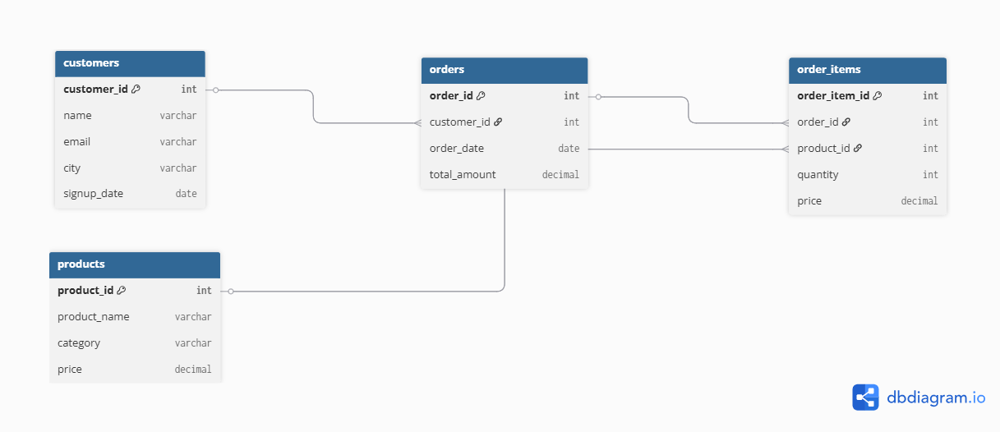

 🛒 E-Commerce SQL Project

 📌 Project Overview
This project demonstrates database design and SQL analysis for an E-commerce platform.  
It includes schema creation, data insertion, and business analysis queries.

 🧰 Technologies Used
- MySQL
- SQL
- Git & GitHub

 🗂 Database Structure
Tables included:
- Customers
- Products
- Orders
- Order_Items
  🧩 Database Schema

This diagram shows the relationships between customers, orders, products, and order_items.

---

📂 Project Structure

- `schema.sql` → Defines database tables  
- `insert_data.sql` → Contains sample data  
- `analysis_queries.sql` → Contains analytical SQL queries  

 ⚙️ Project Files
- schema.sql → Database structure
- insert_data.sql → Sample dataset
- analysis_queries.sql → Business insights queries

 📊 Analysis Performed
- Total revenue calculation
- Top-selling products
- Category-wise sales
- Customer purchase analysis

 🚀 How to Run
1. Run schema.sql
2. Run insert_data.sql
3. Execute analysis_queries.sql

## 👩‍💻 Author
Vinathi Reddy
